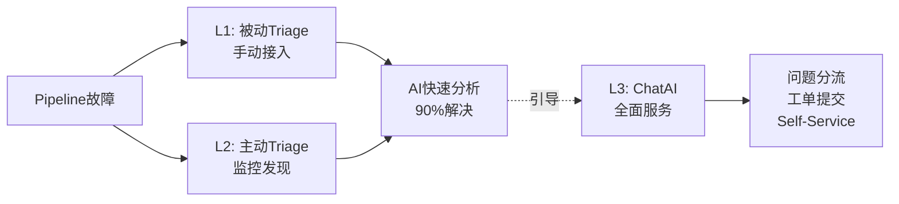
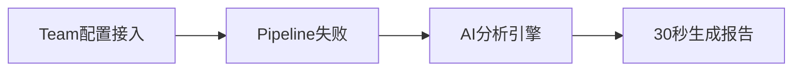
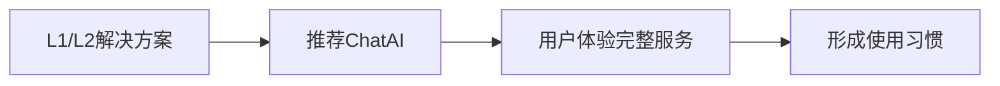

# AIOps Pipeline Intelligence
*DevOps 自动化的智能化演进*

---

## 🎯 项目愿景

> **让AI成为DevOps团队的第一响应者**

**核心目标**：Pipeline Ops作为AIOps的切入点，实现DevOps故障的智能化处理

---

## 📊 当前痛点

DevOps团队每日处理大量重复性CICD失败，初级工程师依赖资深同事指导，故障响应滞后影响交付效率。

---

## 🏗️ AIOps 三层架构



---

## 🚀 L1+L2: 快速Triage (90%问题解决)
*被动接入 + 主动发现*

### L1: 被动Triage (当前Demo)


- 🤖 **GitHub Copilot**：企业级AI引擎诊断
- 📊 **可视化结果**：Build描述+下载报告  
- 🛡️ **零外部依赖**：完全基于内部工具链

### L2: 主动Triage (规划中)
```mermaid
graph LR
    A[Splunk监控] --> B[发现故障模式]
    B --> C[主动AI分析]
    C --> D[Teams推送@用户]
```

- 🔍 **模式识别**：Splunk检测频繁失败
- 📲 **主动推送**：Teams Bot @相关用户
- 🎯 **无感接入**：团队无需手动配置

---

## 🤖 L3: ChatAI 全面服务平台
*L1+L2引导用户的最终目标*

### 核心能力
- 💬 **智能对话**：自然语言交互诊断问题
- 🎯 **问题分流**：自动识别问题类型并路由
- 📋 **工单提交**：一键创建和跟踪支持工单
- 🛠️ **Self-Service**：用户自助解决常见问题

### 引导策略


通过快速Triage的成功体验，引导用户使用更全面的DevOps支持服务

---

## 🛣️ 实施路线

### 阶段1: 立即部署 (当前)
✅ **L1快速Triage** - 基础AI分析已完成

### 阶段2: 主动发现 (3个月)
🚧 **L2主动Triage** - Splunk监控+Teams主动推送

### 阶段3: 全面服务 (6个月)  
🔮 **L3 ChatAI平台** - 问题分流+工单提交+Self-Service

---

## 💡 核心价值

### 对团队
- 🎯 **90%自动化**：L1+L2快速Triage解决绝大部分问题
- ⚡ **即时响应**：从30-60分钟缩短到秒级
- 🛠️ **全面服务**：L3 ChatAI提供完整DevOps支持

### 对企业
- 💰 **零新增成本**：基于现有基础设施
- 🛡️ **企业级安全**：内部工具链，无外部风险
- 🚀 **可扩展**：Pipeline Ops成功后扩展到其他场景

---

## 🚀 现在开始

> **Pipeline Ops是AIOps的第一步**  
> **让我们从L1开始，迈向智能化DevOps！**

**下一步：现场Demo演示** 👨‍💻