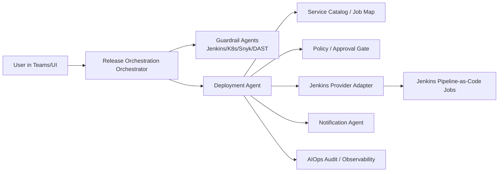
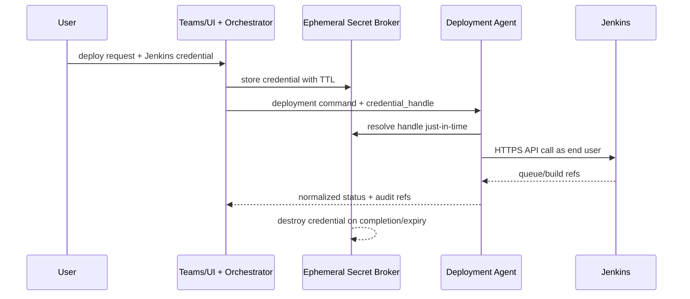

# Deployment Agent Requirements

> Status: Draft for Review
> Parent: [[aiops-blueprint]]
> Scope: UC1-B Release Orchestration 2.0 deployment execution layer
> Last Updated: 2026-05-18

---

## 1. Purpose

This document defines the requirements for the Deployment Agent in the AIOps platform. The Deployment Agent is the write-capable execution agent for release orchestration: it receives a template-resolved deployment plan from the AIOps platform, validates preconditions, triggers the deployment through Jenkins in the current phase, normalizes execution status, and emits auditable state changes back to the platform.

The design deliberately separates:
- preset-template selection, metadata extraction, and conversation handling, which remain in the bot/orchestrator layer
- deployment execution, which belongs to the Deployment Agent
- provider-specific CI/CD behavior, which is hidden behind an adapter interface

Current provider scope is Jenkins. GitHub Actions must be supported later through the same provider abstraction, but is out of scope for implementation in this phase.

---

## 2. Traceability to the Global Blueprint

This specification derives directly from the following blueprint sections in [[aiops-blueprint]]:

- Section 3, UC1-B Release Orchestration 2.0
  - team preset orchestration template resolution becomes structured release parameters
  - guardrail checks run before execution
  - human confirmation is simplified for UAT and mandatory for Prod
  - Jenkins Agent triggers pipelines and Notification Agent pushes progress
- Section 4, Cross-Cutting Capabilities
  - Human-in-the-Loop, Audit Trail, RBAC, and ITIL compliance are mandatory
- Section 4, AI Safety Model
  - mutable actions must pass policy checks
  - production actions require explicit approval and least privilege
  - evidence-linked, fully audited sessions are required
- Section 5, Dependency Map & Build Order
  - the standardized Jenkins Agent is a Phase 1 foundation dependency for Release Orchestration 2.0
- Section 6, Quarterly Roadmap
  - Release Orchestration 2.0 MVP depends on Jenkins plus adjacent Jira/Git capability
- Section 7, Support Requirements
  - GitHub access, Jira integration, and ITIL alignment remain external dependencies
- Section 9, Governance Principles
  - AI suggests, human approves; full audit trail; fail-safe fallback; least privilege

Strictly speaking, this document is the detailed execution-layer contract that the blueprint implies but does not yet spell out.

---

## 3. Scope and Non-Goals

### In scope

The Deployment Agent SHALL:
- accept structured deployment commands from the AIOps platform
- resolve service-to-job mapping through catalog/config data
- enforce idempotency, approval state, and policy preconditions
- trigger Jenkins Pipeline-as-Code jobs using the calling user's Jenkins credential
- normalize queue/build/stage/result data into an AIOps-native deployment model
- expose status, cancel, and rollback operations to peer agents and orchestrators
- emit audit-ready events, logs, metrics, and traces

### Explicitly out of scope

The Deployment Agent SHALL NOT:
- construct release plans outside the approved preset-template workflow
- decide inter-service dependency order in the current phase
- replace Jenkinsfile or pipeline business logic 
- own long-lived provider credentials or shared CI service accounts
- redesign the existing global blueprint
- implement the GitHub Actions adapter in this phase

---

## 4. Role in the AIOps Architecture

The Deployment Agent sits in the shared agent layer between the Release Orchestration 2.0 orchestrator and the execution provider.



### Responsibility boundary

The Deployment Agent is responsible for execution orchestration, not user interaction.

It consumes:
- structured deployment plan
- approval result
- provider credential handle for the calling user
- service/job mapping metadata
- guardrail verdicts from peer agents

It produces:
- accepted/rejected execution decisions
- normalized deployment status
- provider run references such as queue ID, build number, build URL
- rollback capability and audit references
- events for Notification Agent and dashboard consumers

---

## 5. Functional Responsibilities

### 5.1 Primary responsibilities

1. Command intake and validation
   - validate schema version, required fields, target environment, service list, and release reference
   - reject malformed or policy-incompatible requests before any provider call

2. Execution planning
   - resolve service/environment to provider-specific job definitions
   - preserve the human-specified execution order for multi-service releases in the current phase
   - derive a provider-neutral execution plan with ordered deployment units

3. Pre-dispatch gating
   - confirm that all required guardrail verdicts are present
   - enforce approval policy by environment and change type
   - verify that the credential handle is present and unexpired

4. Provider execution
   - call the Jenkins adapter to queue and monitor jobs
   - normalize provider-specific states into a common Deployment Agent state model

5. State reporting
   - emit progress events at request accepted, approval pending, queued, started, stage changed, succeeded, failed, rollback started, rollback succeeded, rollback failed
   - support synchronous status lookup and asynchronous event subscribers

6. Failure handling and rollback
   - distinguish recoverable transport failures from provider-side execution failures
   - provide rollback initiation when rollback metadata exists and policy allows it

### 5.2 Non-functional responsibilities

The Deployment Agent SHALL also provide:
- deterministic request correlation via request_id and deployment_id
- idempotent command handling
- complete auditability without persisting user tokens
- redaction-safe logging
- provider abstraction for future adapters

---

## 6. Deployment Agent State Model

The normalized lifecycle SHALL use the following states:

- received
- validating
- rejected
- awaiting_approval
- approved
- dispatching
- provider_queued
- provider_running
- verifying
- succeeded
- failed
- rollback_pending
- rollback_running
- rolled_back
- rollback_failed
- cancelled
- attention_required

### State rules

- A request MAY enter awaiting_approval only after validation and guardrail collection succeed.
- Prod requests MUST pass through awaiting_approval.
- UAT requests MAY be auto-approved only if the orchestrator already recorded an explicit user confirmation in the upstream conversation flow.
- If the final provider state cannot be determined after a trigger attempt, the Deployment Agent MUST move to attention_required rather than retry blindly.
- Rollback states are distinct from deployment failure states; a failed deployment and a failed rollback are not the same operational event.

---

## 7. Inbound Platform Command Contract

The preferred control plane is a synchronous API for command submission plus asynchronous events for lifecycle updates.

### 7.1 Submission API

`POST /v1/deployments`

### 7.2 Command schema

```json
{
  "schema_version": "1.0",
  "request_id": "req_01J...",
  "idempotency_key": "uat:payment-service,auth-service:main:deploy",
  "command": "deploy",
  "requested_by": {
    "aiops_user_id": "teams:8:orgid:userid",
    "display_name": "Alice Chan",
    "email": "alice@example.com",
    "provider_accounts": {
      "jenkins": "alice.chan"
    }
  },
  "target": {
    "environment": "UAT",
    "services": ["payment-service", "auth-service"],
    "release_ref": "main",
    "artifact_version": null
  },
  "execution": {
    "provider": "jenkins",
    "dry_run": false,
    "ordered_units": [
      {"service": "payment-service", "sequence": 1},
      {"service": "auth-service", "sequence": 2}
    ]
  },
  "guardrails": {
    "ci_status": "passed",
    "environment_health": "passed",
    "security_gate": "passed",
    "approval_required": false,
    "evidence": [
      "jenkins:job/payment-ci#1821",
      "k8s:uat/payment-namespace:healthy",
      "snyk:image/payment@sha256:...:no-new-critical"
    ]
  },
  "change_context": {
    "change_ref": null,
    "ticket_ref": "JIRA-1234",
    "reason": "Release requested from Teams preset orchestration template flow"
  },
  "security_context": {
    "credential_handle": "cred_01J...",
    "credential_subject": "jenkins:user/alice.chan",
    "expires_at": "2026-05-18T11:15:00Z"
  },
  "response_mode": "async"
}
```

### 7.3 Contract requirements

- `request_id` MUST be globally unique.
- `idempotency_key` MUST uniquely represent one deploy plan for one environment and release reference.
- `security_context.credential_handle` MUST be opaque; raw tokens MUST NOT appear in the command payload, queue payload, logs, or events.
- `ordered_units` MUST preserve human-defined release order in the current phase; no implicit dependency solver is allowed yet.
- `guardrails.evidence` MUST contain references, not full log payloads.

### 7.4 Immediate response

The submission API SHOULD return:

```json
{
  "deployment_id": "dep_01J...",
  "request_id": "req_01J...",
  "status": "received",
  "provider": "jenkins",
  "accepted_at": "2026-05-18T10:55:00Z"
}
```

---

## 8. Peer-Agent Request and Response Contract

Peer agents and orchestrators need a stable internal contract to query state, request operator-visible actions, and trigger rollback.

### 8.1 Internal peer API

`POST /internal/deployment-agent/v1/requests`

### 8.2 Peer request schema

```json
{
  "schema_version": "1.0",
  "request_id": "req_peer_01J...",
  "caller_agent": "notification-agent",
  "operation": "get_status",
  "deployment_id": "dep_01J...",
  "arguments": {
    "include_provider_refs": true,
    "include_stage_history": true
  }
}
```

Supported `operation` values in phase 1:
- `get_status`
- `cancel`
- `request_rollback`
- `get_execution_evidence`

### 8.3 Peer response schema

```json
{
  "request_id": "req_peer_01J...",
  "deployment_id": "dep_01J...",
  "status": "provider_running",
  "provider": {
    "name": "jenkins",
    "queue_id": "481992",
    "build_number": 2841,
    "build_url": "https://jenkins.example/job/payment-deploy/2841/"
  },
  "timeline": [
    {
      "state": "provider_queued",
      "at": "2026-05-18T10:56:11Z"
    },
    {
      "state": "provider_running",
      "at": "2026-05-18T10:57:02Z"
    }
  ],
  "next_action": {
    "recommended_poll_after_seconds": 15,
    "rollback_available": true
  }
}
```

### 8.4 Event contract

The Deployment Agent SHALL also publish normalized events for asynchronous consumers.

Required event types:
- `deployment.requested.v1`
- `deployment.awaiting_approval.v1`
- `deployment.approved.v1`
- `deployment.dispatched.v1`
- `deployment.stage_updated.v1`
- `deployment.succeeded.v1`
- `deployment.failed.v1`
- `deployment.rollback_started.v1`
- `deployment.rollback_succeeded.v1`
- `deployment.rollback_failed.v1`
- `deployment.attention_required.v1`

Each event MUST include at least:
- event_id
- event_type
- deployment_id
- request_id
- emitted_at
- requested_by.aiops_user_id
- provider.name
- provider reference fields if known
- summarized human-safe message

---

## 9. Jenkins Integration Design

## 9.1 Design principles

The Jenkins adapter SHALL use Jenkins as an execution provider, not as an orchestration brain. In other words, the Deployment Agent decides what action to request and why; Jenkins executes the job defined in Pipeline-as-Code.

This keeps the abstraction correct:
- AIOps owns request normalization, policy enforcement, audit correlation, and status normalization.
- Jenkins owns pipeline execution, stage logic, and downstream deployment mechanics.

## 9.2 Jenkins capabilities required in phase 1

The Jenkins adapter SHALL support:
- job discovery from a catalog-backed job reference
- queueing parameterized jobs
- retrieving queue item, build number, build URL, and result
- polling build state and terminal result
- retrieving stage-level progress when available
- invoking rollback jobs or rollback pipeline entrypoints when defined for the target service

## 9.3 Pipeline-as-Code contract

Deployment logic MUST remain in Jenkinsfiles or shared libraries, not in the agent.

The standardized parameter set passed from the Deployment Agent to Jenkins SHOULD include:
- `AIOPS_REQUEST_ID`
- `AIOPS_DEPLOYMENT_ID`
- `AIOPS_ACTOR_ID`
- `SERVICE_NAME`
- `TARGET_ENV`
- `RELEASE_REF`
- `ARTIFACT_VERSION` if applicable
- `CHANGE_REF`
- `ROLLBACK_TO` for rollback requests
- `DRY_RUN`

The parameter set MUST NOT include:
- raw Jenkins user token
- raw GitHub token
- unrelated chat transcript content
- full secret values from upstream systems

## 9.4 Service catalog mapping

The Deployment Agent SHOULD resolve each deployment unit by consulting a service catalog or equivalent configuration record containing at minimum:
- service name
- target environment
- Jenkins job path
- allowed commands: deploy, status, rollback
- approval policy override if stricter than environment default
- rollback strategy type
- notification routing metadata

## 9.5 Jenkins-specific operational notes

- The adapter SHOULD prefer standard Jenkins REST APIs and existing Pipeline-as-Code conventions.
- Queue and build references MUST be captured immediately after dispatch to avoid ambiguous retry behavior.
- If Jenkins exposes stage data through additional APIs or plugins, the adapter MAY normalize them, but terminal success/failure MUST still work without stage plugins.
- CSRF or crumb handling, where required by the Jenkins instance, belongs inside the adapter and must not leak into higher-level contracts.

---

## 10. Provider Abstraction Layer

A provider-neutral interface is required so Jenkins is only one adapter, not the architecture.

### 10.1 Required provider interface

```text
interface DeploymentProvider {
  validateCredential(handle, subject)
  resolveTarget(service, environment)
  preflight(plan)
  startDeployment(plan)
  getExecutionStatus(provider_run_ref)
  cancel(provider_run_ref)
  rollback(rollback_request)
  getAuditReferences(provider_run_ref)
  capabilities()
}
```

### 10.2 Required normalized outputs

Every provider adapter MUST return a common shape containing:
- provider name
- provider run reference
- current normalized state
- terminal result if known
- stage summaries if available
- audit references
- rollback capability metadata

### 10.3 Extension points reserved for GitHub Actions

Future GitHub Actions support must plug into the same interface by swapping only the adapter and provider-specific catalog fields.

The following extension points MUST remain provider-neutral now:
- provider name and run reference shape
- credential subject model
- capability discovery, for example supports_manual_approval or supports_stage_streaming
- environment mapping and job/workflow reference lookup
- audit reference model: run URL, actor, workflow/job name
- rollback invocation contract

### 10.4 Explicit non-goal for this phase

No GitHub Actions implementation detail is required now. This document only requires that the Deployment Agent boundary not become Jenkins-specific in a way that blocks a second adapter later.

---

## 11. Authentication and User-Token Passthrough Model

This is the most important security requirement: the Deployment Agent MUST execute provider calls using the calling user's provider credential, not a standing shared automation account.

### 11.1 Required model

1. The user initiates a deployment from Teams/UI.
2. The platform collects the user's Jenkins credential through a secure channel.
3. The raw credential is stored only in an ephemeral secret broker or in-memory vault with a short TTL.
4. The orchestrator sends only an opaque `credential_handle` to the Deployment Agent.
5. The Deployment Agent resolves the handle just-in-time, uses it for the Jenkins API call, and never writes the raw token to disk, queue payloads, traces, or logs.
6. After terminal completion or timeout, the credential handle is destroyed.

### 11.2 Authentication flow



### 11.3 Audit preservation requirement

To preserve the audit trail on the Jenkins side, the adapter SHALL:
- authenticate using the end user's Jenkins identity rather than translating to a shared service account
- capture Jenkins-native references such as queue ID, build number, build URL, and authenticated account identifier
- pass AIOps correlation fields such as `AIOPS_REQUEST_ID` and `AIOPS_ACTOR_ID` as non-secret build parameters for cross-system traceability

The intended effect is that Jenkins audit logs and build metadata can answer both questions:
- which human requested this deployment?
- which AIOps session and decision path triggered it?

### 11.4 Important boundary

The user-supplied Jenkins credential authorizes the trigger and status operations against Jenkins. It MUST NOT be reused as a downstream cluster credential. Cluster deployment secrets remain owned by Jenkins-managed credentials or workload identity mechanisms under least-privilege control.

### 11.5 Token hygiene requirements

- Raw provider tokens MUST NOT appear in chat transcripts.
- Raw provider tokens MUST NOT be embedded in durable queue messages.
- Raw provider tokens MUST NOT be written to build parameters, environment dumps, logs, traces, metrics labels, or error payloads.
- Secret-bearing headers MUST be redacted before logging.
- Memory holding resolved credentials SHOULD be zeroized or released immediately after use.
- If the credential expires during a long-running request, the deployment MUST move to `attention_required` unless a secure refresh path exists.

---

## 12. Approval Gates and Governance Requirements

### 12.1 Environment policy

- Dev and test environments MAY use lightweight confirmation if defined by the orchestrator policy.
- UAT requires explicit confirmation from the requesting user before dispatch.
- Prod requires mandatory Human-in-the-Loop approval plus change-management evidence before dispatch.

### 12.2 Required approval data for Prod

A Prod command SHOULD include or reference:
- approver identity
- approval timestamp
- change record or equivalent ITIL reference
- release reason or deployment summary
- rollback readiness confirmation

### 12.3 Policy enforcement

The Deployment Agent MUST reject or hold requests when:
- required guardrail verdicts are missing
- security gate returns block
- environment policy requires approval and no approval record exists
- service catalog marks the target as freeze-window protected
- the provider credential does not match the declared user identity

---

## 13. Idempotency, Retries, and Error Semantics

### 13.1 Idempotency

The Deployment Agent MUST support idempotent submission.

For the same `idempotency_key`:
- if a matching request is still active, return the existing `deployment_id`
- if the prior request already succeeded, return the prior result unless caller explicitly asks for redeploy
- if provider outcome is unknown, do not trigger again automatically; return `attention_required`

### 13.2 Retry rules

Safe automatic retries are limited to transport-level failures before a provider run reference is created.

The agent MUST NOT automatically retry when:
- Jenkins may already have accepted the job
- the failure occurs after queue ID or build number exists
- the error is policy-related or approval-related
- the request targets Prod without renewed human approval

### 13.3 Error classes

Errors SHALL be normalized into at least:
- validation_error
- policy_denied
- credential_error
- provider_unavailable
- provider_rejected
- execution_failed
- rollback_failed
- unknown_outcome

Each error MUST include:
- machine-readable class
- human-readable summary
- retryable true or false
- correlation IDs
- safe evidence references

---

## 14. Rollback Strategy Requirements

Rollback must be designed as a first-class operation, not an afterthought.

### 14.1 Minimum rollback requirements

For each deployable service/environment pair, the catalog SHOULD declare one rollback mode:
- redeploy last-known-good artifact
- invoke dedicated rollback pipeline
- restore previous configuration revision
- manual-only rollback, if no safe automated strategy exists

### 14.2 Rollback preconditions

Before initiating rollback, the agent SHOULD know:
- last successful build or artifact reference
- rollback method supported by the target service
- whether rollback requires a fresh approval in the target environment
- whether compensating actions, such as database migration reversal, remain manual

### 14.3 Rollback policy

- Non-prod rollback MAY auto-start when explicitly requested by the user or orchestrator.
- Prod rollback MUST require explicit approval unless policy classifies the action as pre-approved and reversible under incident procedures.
- Rollback actions MUST generate separate audit events and not overwrite the original deployment record.

---

## 15. Observability and Audit Requirements

### 15.1 Logs

Structured logs MUST include:
- deployment_id
- request_id
- environment
- service list
- provider name
- normalized state transition
- latency bucket
- safe error class

Logs MUST exclude secrets and oversized payloads.

### 15.2 Metrics

The Deployment Agent SHOULD emit at minimum:
- deployments_requested_total by environment and provider
- deployments_succeeded_total
- deployments_failed_total by error class
- deployment_duration_seconds
- approval_wait_seconds
- rollback_started_total
- rollback_succeeded_total
- provider_api_latency_seconds
- idempotent_reuse_total

### 15.3 Traces

Distributed traces SHOULD cover:
- orchestrator to deployment agent handoff
- credential handle resolution
- Jenkins API round trips
- status polling loop
- notification emission

### 15.4 Audit event minimums

Every deployment session MUST persist durable audit metadata containing:
- requested_by identity
- approval identity if applicable
- request payload fingerprint, not the raw secret-bearing payload
- guardrail verdict summary
- provider run references
- final outcome
- rollback outcome if any
- links to logs/traces and user-facing notifications

---

## 16. Rate Limiting, Concurrency, and Safety Limits

The Deployment Agent SHOULD enforce:
- per-user request rate limits
- per-environment concurrency limits
- per-service active deployment limits
- provider back-pressure handling when Jenkins queue depth exceeds policy

Safety rules:
- Prod deployments for the same service MUST serialize unless an explicit exception policy exists.
- Duplicate active requests against the same service/environment/release_ref SHOULD collapse through idempotency.
- Long-running polling loops MUST use bounded intervals and timeout budgets.

---

## 17. Fail-Safe and Fallback Behavior

Consistent with the blueprint governance principles:
- if the Deployment Agent is unavailable, the user must fall back to the existing manual Release Orchestration/Jenkins flow
- if guardrail evidence is incomplete, the agent must stop and request human attention
- if provider status becomes ambiguous, the agent must not guess success; it must expose `attention_required`
- if rollback automation is unavailable, the agent must produce a human-readable rollback handoff with provider references

---

## 18. Acceptance Criteria for the Phase 1 Agent Spec

This requirements document is satisfied only if the implementation plan derived from it can support the following behaviors:

1. A Release Orchestration 2.0 orchestrator can submit one deployment command with ordered services and receive a `deployment_id` immediately.
2. The Deployment Agent can trigger Jenkins jobs with the end user's Jenkins credential without persisting the raw token.
3. Status can be queried uniformly even though Jenkins-specific queue/build details exist underneath.
4. Prod requests stop at approval until an explicit approval artifact is present.
5. Rollback is represented as an explicit operation with separate audit records.
6. GitHub Actions can later be introduced as a second provider without changing the orchestrator-facing contract.

---

## 19. Open Questions for Next Design Pass

- What is the enterprise-standard secure channel for collecting user Jenkins credentials in Teams/UI?
  A: I'm don't user direct send cmd to deployment agent it's should under L2, token can go though and store in coplit studio/AIOps Platform by real user.
- Does the current Jenkins setup expose sufficient audit logs to show authenticated API actor per trigger, or is an audit plugin/configuration change required?
  A: Out of scope. no need concern jenkins it self.
- What is the exact source of truth for service-to-Jenkins-job mapping before Service Catalog MVP is mature?
  A: Currently the idea is metadata store in Github repo, like yaml config.
- Should UAT approval be recorded only in AIOps, or also mirrored into Jenkins build metadata as an approval artifact?
  A: Only PROD need appove, approval actions will be passed to the operating platform (Jenkins), and no special record is required.
- Which rollback modes are realistically automatable per service class in the first release?
  A: No need for first release.
- Implementation ways.
  A: For MVP stage, start from scratch, for feature use AgentScope framework.
- Q for BA: The current Deployment Agent reads like a Jenkins wrapper rather than an AI-powered agent.
  BA answer:
  - This is expected in MVP. The architecture intentionally separates AI reasoning from execution.
  - AI responsibilities live in the Release Orchestrator and guardrail layer: template resolution, pre-release checks, Go/No-Go recommendation, workflow guidance, and user-facing explanation.
  - Deployment Agent responsibilities are execution-specific: validate structured release commands, enforce approval/policy/credential checks, trigger Jenkins, normalize provider status, and emit audit events.
  - So the right framing is not "standalone AI copilot," but "AI-governed execution agent" or "Jenkins-first execution agent within the Release Orchestration system."
  - Recommendation for the next design pass: add one explicit paragraph near the Purpose/Architecture sections clarifying that AI is primarily responsible for interpretation and decision support, while Deployment Agent is the controlled action layer.
  - Optional follow-up for product/architecture owner: decide whether the current name should stay `Deployment Agent` or be renamed to something more explicit such as `Release Execution Agent`. This is a naming choice, not a blocker for MVP.

---

## 20. Summary

From a systems point of view, the Deployment Agent is the missing execution contract between Release Orchestration 2.0 template-driven planning and Jenkins job execution. Its defining properties are:
- provider-neutral control plane
- Jenkins-first adapter
- end-user credential passthrough
- explicit approval and rollback semantics
- full auditability and observability

That is, if the blueprint defines what Release Orchestration 2.0 should feel like, this document defines what the deployment execution layer must guarantee so the experience is safe, traceable, and extensible.
